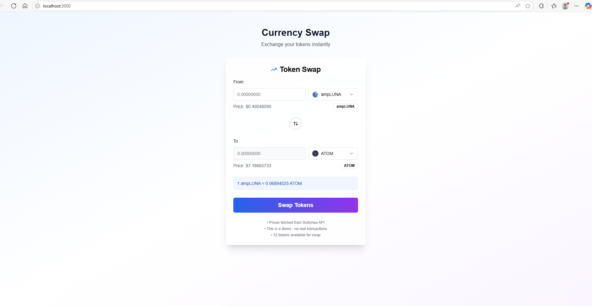

# Wallet Project



## Project Description

This project is a **Currency Swap Wallet** web application built with [Next.js](https://nextjs.org/), React, and TypeScript. It allows users to instantly exchange tokens with a user-friendly interface. The app features:

- Token swap functionality with real-time price fetching (from Switcheo API)
- Modern UI with Tailwind CSS
- Demo mode (no real transactions)
- Support for 32 tokens

## Requirements

- **Node.js**: v22.12.x
- **Yarn**: v1.22+ (recommended)

## Getting Started

1. **Install dependencies:**
   ```bash
   yarn install
   ```

2. **Start the development server:**
   ```bash
   yarn dev
   ```
   The app will be available at [http://localhost:3000](http://localhost:3000) by default.

3. **Build for production:**
   ```bash
   yarn build
   ```

4. **Start the production server:**
   ```bash
   yarn start
   ```

## Project Structure

- `app/` - Next.js app directory (pages, layouts, etc.)
- `components/` - Reusable React components
- `hooks/` - Custom React hooks
- `lib/` - Utility functions
- `public/` - Static assets (including images)
- `styles/` - Global and component styles
- `tailwind.config.ts` - Tailwind CSS configuration
- `postcss.config.mjs` - PostCSS configuration

## Notes

- Prices are fetched from the Switcheo API.
- This is a demo project; no real transactions are performed.
- Make sure you are using **Node.js 22.12.x** for best compatibility.

---

Feel free to customize this README as your project evolves!
